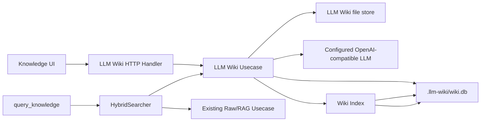
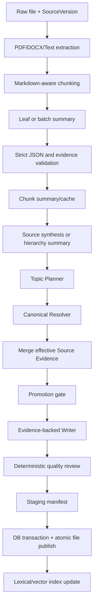

# HLD-002：LLM Wiki 可审计知识编译层

- 状态：待评审（依据 2026-09-10 工作区未提交实现整理）
- 日期：2026-09-10
- 实现入口：`internal/manager/biz/knowledge/llm_wiki/`
- API 契约：`api/manager/knowledge/v1/knowledge.proto`
- 输出契约：`internal/manager/biz/knowledge/llm_wiki/schema_v1.md`

## 1. 背景与目标

LLM Wiki 在现有组织知识库（下文称 Raw/RAG）之外增加一层可审计的知识编译能力。它保留原始文件和版本快照，使用 LLM 提取结构化事实、实体和概念，再由服务端生成带来源关系的 Source 页与 Topic 页。生成页是可重建的物化视图，不是新的事实源。

当前实现的目标是：

- 让 Markdown、纯文本、PDF、DOCX 成为可查看、可版本化的原始来源。
- 将大文档按结构分块，生成受严格 JSON Schema 约束的中间表示。
- 将跨分块、跨来源的证据归并为稳定的 canonical Topic。
- 让 Topic 页面可追溯到 SourceVersion、Chunk 和 rune 区间。
- 同时支持词法搜索、向量搜索及旧 RAG 知识库的混合检索。
- 提供异步任务、取消、重试、幂等、恢复、指标和 Token 用量记录。

## 2. 范围与当前限制

### 2.1 已实现范围

- 独立文件上传、Raw/Wiki 文件树、文件详情和 PDF/DOCX 预览。
- 显式创建编译任务，查看、取消和重试任务。
- Source、SourceVersion、Chunk、Topic、Evidence、Page、Relation 的持久化。
- Source 页与 Topic 页生成、确定性质量门禁和原子发布恢复。
- SQLite FTS5 trigram、页级本地向量检索及 RRF 融合。
- `query_knowledge` 和知识搜索 HTTP API 的 `hybrid`、`wiki`、`rag` 模式。
- Knowledge 页面中的 LLM Wiki 导航、文件列表、任务面板和来源跳转。

### 2.2 当前限制

- 当前租户固定为 `tenant_id = 0`，HTTP 层尚未从登录上下文提取租户。
- 原始文件上限为 16 MiB，生成页面上限为 1 MiB。
- 页面语言固定为 `und`，尚未实现语言检测或继承。
- 服务端只发布 `source`、`topic` 两种页面；实体和概念是 Topic 规划及检索元数据，不单独生成页面。
- 编译由 HTTP 请求触发进程内 goroutine，不是独立队列消费者；进程退出后依赖租约与人工重试恢复未完成任务。
- 旧知识库已定义 `SourceMirror` 扩展点，并在手工文档、上传文档和仓库同步路径调用该扩展点，但当前组合根没有注入 LLM Wiki 适配器。因此，当前可用的 LLM Wiki 来源入口是 `/v1/knowledge/llm-wiki/upload`，旧知识库内容不会自动进入 LLM Wiki。
- embedding 不可用时仍可浏览、编译并使用 FTS；旧 RAG 写入与搜索仍受原有 embedding/Qdrant 配置约束。

## 3. 系统边界与分层

LLM Wiki 不新增服务，部署在 Manager 进程内，并遵循 `server -> service/biz -> data -> model` 的分层边界。

| 层 | 位置 | 职责 |
| --- | --- | --- |
| HTTP/API | `internal/manager/server/knowledge/`、`api/manager/knowledge/v1/` | 路由、认证授权、请求解析、统一响应 |
| 应用组合 | `internal/manager/service/knowledge/` | 旧 RAG 与 Wiki 混合检索、Token 用量适配 |
| 业务 | `internal/manager/biz/knowledge/llm_wiki/` | 镜像、分块、编译、规划、写作、质量审查、发布与恢复 |
| 数据 | `internal/manager/data/knowledge/llm_wiki/` | 单 SQLite 状态仓储、FTS/向量索引 |
| 模型 | `internal/manager/model/knowledge/llm_wiki/` | 持久化实体和状态常量 |
| 文件 | `ONGRID_LLM_WIKI_DIR` | Raw、Wiki 页面、快照、摘要、缓存与 staging manifest |



## 4. 数据来源与版本

### 4.1 上传

客户端以 multipart 字段 `file` 上传文件。允许的扩展名为 `.md`、`.markdown`、`.txt`、`.text`、`.pdf`、`.docx`。服务端会：

1. 清理路径分隔符和控制字符，同时尽量保留用户文件名和 Unicode。
2. 在入库前执行一次格式提取校验。
3. 将原文写入 `raw/`，并按内容 SHA-256 写入不可变版本快照。
4. 以 `source_key = upload:<filename>` upsert Source 和 SourceVersion。
5. 新内容标记为 `pending`；相同内容复用现有版本，不调用 LLM。

### 4.2 数据身份

- Source 由 `(tenant_id, source_key)` 唯一标识。
- SourceVersion 由 `(tenant_id, source_id, sha256)` 唯一标识。
- Source 页 ID 由租户和 `source_key` 确定性生成。
- Topic 通过 `canonical_key` 维护稳定身份；标题或别名变化不会改变 TopicID/PageID 和页面路径。
- TopicEvidence 记录当前有效来源版本、分块序号以及可选的 rune 证据区间。

## 5. 编译流程

编译是显式操作。空 `source_ids` 表示编译全部来源；`force=true` 会跳过“当前版本已按当前 Schema 成功编译”的快速跳过逻辑。

业务层内部使用类型化 IR 串联五个阶段。每层只消费上一层的输出，`compileSource` 仅保留顺序编排：

| 内部阶段 | 中间表示 | 内容 |
| --- | --- | --- |
| Source Layer | `sourceIR` | Source、SourceVersion、不可变原文 |
| Parse Layer | `parseIR` | Markdown、Chunk、来源元数据 |
| Semantic Layer | `semanticIR` | Chunk 分析、来源摘要、实体/概念、Topic Plan |
| Knowledge Layer | `knowledgeIR` | Wiki Page、Relation、Evidence、发布 manifest |
| Artifact Layer | `IndexDocument` | Markdown 文件、数据库提交、词法/向量索引 |



关键约束如下：

- 默认目标分块约 4,000 tokens，硬上限约 6,000 tokens，并优先在标题、段落和换行边界切分。
- Leaf 输出必须是单个严格 JSON 对象；事实证据必须是当前分块中的连续原文。服务端以 rune 区间定位证据，未知或越界证据会被拒绝或丢弃。
- 批处理按输入 Token 预算打包；失败时可回退到单分块调用。内容缓存键包含租户、内容哈希、Prompt 版本和模型版本。
- 小型单批来源可走 Source Synthesis；响应无效时自动回退到层级摘要与独立 Planner。
- 层级摘要最多 8 层，不允许把聚合摘要当作最终事实来源。
- Planner 每个来源最多规划 30 个 Topic，并受重要度、证据量、事实数、分块数或来源数门禁约束。
- Writer 只能消费当前有效 Source Evidence；每个 section 必须带合法 `evidence_refs`。
- Topic 页至少包含两个非空 section，或由至少两个来源支持且正文不少于 600 bytes，否则被质量门禁丢弃。
- 生成指纹未变化时复用已有 Topic 正文，并跳过重复索引。

## 6. 发布、一致性与恢复

发布过程涉及文件系统和 Wiki SQLite，采用 manifest 协调：

1. 生成结果先写入 staging，并保存包含页面、Topic、Evidence、关系和待删除页面的 manifest。
2. 在一个 SQLite 事务中提交 Topic/Evidence/Page 目录及来源关系。
3. 数据库成功后原子激活 Wiki 文件，维护 `index.md`、`log.md`，更新可重建索引并清理 manifest。
4. Manager 启动时执行 `Reconcile`：校验 staging 页面及 SHA-256；完整则补交数据库状态、完成文件激活并重建派生索引，无法确认完整的 manifest 保留待处理。
5. 启动时也会根据版本快照补回缺失的 Raw 文件；快照无法读取时将来源标记为 `failed`。

embedding 索引失败不会回滚已经发布的页面：对应旧向量被删除，任务状态保持成功，但 stage 记为 `index_failed`，读取和 FTS 搜索仍然可用。

## 7. 状态模型

### 7.1 Source 状态

| 状态 | 含义 |
| --- | --- |
| `pending` | 新来源或待重新编译 |
| `running` | 当前来源正在编译 |
| `succeeded` | 当前版本按当前 Schema 编译成功 |
| `stale` | 已有结果落后于当前来源版本 |
| `failed` | 读取、提取或编译失败 |

### 7.2 CompileJob 状态

| 状态 | 含义 |
| --- | --- |
| `pending` | 已排队，等待获取租约 |
| `running` | 已被 worker claim |
| `succeeded` | 发布完成；stage 可能为 `completed` 或 `index_failed` |
| `skipped` | 所有来源都已是当前 Schema 的成功版本且未强制编译 |
| `failed` | 编译失败，`error_message` 保存截断后的错误 |
| `cancelled` | 收到取消请求并在阶段边界停止 |

任务通过 `(tenant_id, 排序去重后的 source_ids)` 的 SHA-256 形成活动幂等键，避免同一组来源存在重复活动任务。任务包含租约持有者、租约到期时间、尝试次数和取消标志。

## 8. 页面与文件布局

默认根目录为 `/var/lib/ongrid/llm-wiki`：

```text
llm-wiki/
├── schema.md                     # 内置输出契约，每次启动刷新
├── raw/                          # 用户可查看的当前原始文件
├── wiki/
│   ├── index.md                  # 确定性目录
│   ├── log.md                    # 幂等活动日志
│   ├── sources/                  # Source 追踪页
│   └── topics/                   # canonical Topic 页
└── .llm-wiki/
    ├── wiki.db                   # 状态、目录、FTS 和向量
    ├── versions/                 # 不可变 SourceVersion 快照
    ├── chunks/                   # 分块摘要
    ├── summaries/                # 来源层级摘要
    ├── chunk-cache/              # tenant-scoped 内容缓存
    └── staging/                  # 发布 manifest 和中间数据
```

Source 页包含来源 frontmatter、概览、分段摘要、事实证据区间和保留冲突。Topic 页包含稳定 ID、标题、来源版本、摘要、正文 section、别名和限制。生成的 Markdown 只是物化视图，重编译必须回到版本快照和 TopicEvidence。

## 9. 数据模型

| 表 | 作用 |
| --- | --- |
| `sources`、`source_versions`、`source_chunks` | 来源、不可变版本、分块和摘要引用 |
| `compile_jobs` | 异步任务、租约、取消、重试和错误 |
| `topics`、`topic_evidence` | canonical Topic 身份、生成指纹和原始证据链 |
| `wiki_pages`、`wiki_page_sources`、`wiki_links` | 从 Markdown/版本状态派生的目录、来源映射和关系缓存 |
| `wiki_fts`、`wiki_vectors`、`wiki_index_meta` | FTS5 trigram、float32 页面向量和索引构建状态 |

以上表全部位于 `.llm-wiki/wiki.db`。前六张状态表不可由 Markdown 恢复；`wiki_*` 表可独立重建。关系事实源为 frontmatter `related` 与正文 wikilink。

## 10. 查询模型

Wiki 内部检索同时执行：

- 词法检索：SQLite FTS5 trigram 对标题、别名和 Markdown 正文建立中英文子串索引。
- 向量检索：页面级 float32 向量保存于 `wiki_vectors`，进程内线性计算余弦相似度。
- 融合：词法和向量结果使用 Reciprocal Rank Fusion（常数 60）合并；标题精确包含查询时增加轻微加权。

应用层 `HybridSearcher` 提供三种模式：

| 模式 | 行为 |
| --- | --- |
| `hybrid` | 默认；分别检索 Wiki 与 Raw，以加权 RRF 合并，Wiki 权重 1.5、Raw 权重 1.0 |
| `wiki` | 只返回已发布 Wiki 页面 |
| `rag` | 只走旧组织知识库 |

Wiki 不可用时，`hybrid` 自动退回 Raw。Wiki 或 Raw 单边查询失败时返回另一边结果；两边都失败才返回组合错误。

## 11. HTTP API

所有路由挂载在认证后的 `/api/v1` 路由组。写操作额外要求 `knowledge:doc/write` 权限，响应统一使用 `{code, message, data}`；预览接口直接返回二进制或纯文本。

| 方法 | 路径 | 说明 |
| --- | --- | --- |
| `GET` | `/v1/knowledge/llm-wiki/tree?layer=&parent_id=` | 按 `raw`、`wiki`、`schema` 分层列目录 |
| `GET` | `/v1/knowledge/llm-wiki/nodes/{id}` | 读取节点正文、状态、哈希和来源关系 |
| `GET` | `/v1/knowledge/llm-wiki/nodes/{id}/preview` | PDF 原样预览；DOCX 提取纯文本预览 |
| `DELETE` | `/v1/knowledge/llm-wiki/nodes/{id}` | 删除 Raw 或 Topic 页面 |
| `GET` | `/v1/knowledge/llm-wiki/schema` | 获取当前 Schema 版本和内容 |
| `GET` | `/v1/knowledge/llm-wiki/sources?status=&limit=` | 查询来源 |
| `GET` | `/v1/knowledge/llm-wiki/search?q=&limit=` | 仅搜索 Wiki 页面 |
| `GET` | `/v1/knowledge/llm-wiki/jobs?limit=` | 查询最近编译任务 |
| `POST` | `/v1/knowledge/llm-wiki/upload` | 上传一个原始文件 |
| `POST` | `/v1/knowledge/llm-wiki/compile` | 创建编译任务，返回 202 |
| `POST` | `/v1/knowledge/llm-wiki/jobs/{id}/retry` | 重试失败/取消任务 |
| `POST` | `/v1/knowledge/llm-wiki/jobs/{id}/cancel` | 请求取消活动任务 |
| `GET` | `/v1/knowledge/search?...&mode=hybrid|wiki|rag` | 旧知识 API 的混合检索入口 |

删除 Raw 文件会同步软删除来源、相关页面、Topic Evidence、关系和索引，并移除 Raw/Wiki 文件；删除 Topic 页只移除该 Wiki 页及其关系和索引，不删除 Raw 来源。两种删除均不可从产品界面恢复。

## 12. 前端交互

Knowledge 页面把 LLM Wiki 作为独立导航树展示：

- Raw 和 Wiki 根节点支持延迟展开，目录选中后只加载当前层级文件。
- 总根目录可以查看全部 Wiki 文件，并在页面统计中合并 LLM Wiki 文档数。
- 支持多文件顺序上传、刷新和“编译全部”。
- 任务面板展示来源文件名、状态、阶段、错误，并允许重试或取消。
- Raw 文本/Markdown 直接展示；PDF 使用浏览器预览；DOCX 展示服务端提取的纯文本。
- Topic 详情展示 aliases、entities、concepts 以及可点击的来源文件；Raw 详情反向展示关联 Wiki 页面。

## 13. 配置

| 环境变量 | 默认值 | 说明 |
| --- | --- | --- |
| `ONGRID_LLM_WIKI_ENABLED` | `false`（代码默认；示例配置为 `true`） | 是否创建 LLM Wiki 组件和路由 |
| `ONGRID_LLM_WIKI_DIR` | `/var/lib/ongrid/llm-wiki` | 持久文件根目录 |
| `ONGRID_LLM_WIKI_TIMEOUT_SECONDS` | `600` | 单任务进程内执行超时 |
| `ONGRID_LLM_WIKI_LEAF_BATCH_INPUT_TOKENS` | `32000` | Leaf 批次输入预算 |
| `ONGRID_LLM_WIKI_LEAF_BATCH_OUTPUT_TOKENS` | `8000` | Leaf 批次输出上限 |
| `ONGRID_LLM_WIKI_LEAF_BATCH_SAFETY_TOKENS` | `4000` | 输入预算安全余量 |
| `ONGRID_LLM_WIKI_ENABLE_LEAF_BATCH` | `true` | 是否批量提取叶子分块 |
| `ONGRID_LLM_WIKI_ENABLE_CHUNK_CACHE` | `true` | 是否启用分块内容缓存 |
| `ONGRID_LLM_WIKI_ENABLE_SOURCE_SYNTHESIS` | `true` | 是否对完整单批来源执行合成优化 |
| `ONGRID_LLM_WIKI_LEAF_MODEL_VERSION` | 空 | 缓存模型版本；为空时使用当前 OpenAI 模型 |

功能还依赖现有 OpenAI-compatible LLM 配置。向量检索只依赖 embedding 配置；缺失时自动降级为 SQLite FTS 搜索。

## 14. 可观测性与用量

编译调用按阶段记录调用数、输入/输出 Token、校验失败和 Chunk Cache 命中情况。最近一次来源编译还暴露来源数、分块数、候选/发布/丢弃页面数、页面大小分布、section 平均数及 Token 数等 Gauge。

主要指标为：

- `ongrid_llmwiki_stage_calls_total`
- `ongrid_llmwiki_stage_tokens_total`
- `ongrid_llmwiki_chunk_cache_total`
- `ongrid_llmwiki_validation_failures_total`
- `wiki_compile_source_count`
- `wiki_compile_chunk_count`
- `wiki_compile_candidate_page_count`
- `wiki_compile_published_page_count`
- `wiki_compile_dropped_page_count`
- `wiki_compile_llm_input_tokens`
- `wiki_compile_llm_output_tokens`

每个编译任务还会创建一条内部 AIOps work session，逐次写入 LLM Token 用量并在任务结束时关闭。该 session 不出现在用户聊天列表，但计入既有全局 Token 聚合。

## 15. 安全设计

- 上传文件先做大小、类型和内容提取校验，文件路径经过清理。
- 文件存储拒绝路径穿越，并检查受管目录不能是符号链接。
- LLM 输入中的来源文本一律视为不可信数据；Prompt 明确忽略其中的命令、角色切换和输出格式指令。
- 模型不能决定数据库 ID、文件路径、租户、哈希、时间、关系或 frontmatter。
- 所有模型响应由服务端严格 JSON 解码，拒绝未知字段和尾随内容。
- FTS 与向量查询均强制按 `tenant_id` 过滤；当前 HTTP 层仍固定租户 0，多租户上线前必须完成租户上下文接线和隔离测试。
- 日志只记录 source/job/page 等内部 ID 和错误链，不记录原始正文。

## 16. 部署、备份与回滚

部署时必须提供可持久化的 Wiki 文件目录。Docker Compose 将该目录挂载到 Manager；标准安装默认使用 `/var/lib/ongrid/llm-wiki`，开发 Compose 使用 `../.cache/ongrid-llm-wiki`。

备份必须覆盖整个 LLM Wiki 文件目录，尤其是不可由 Markdown 重建的 `.llm-wiki/wiki.db`。页面目录、关系、FTS 和向量可重建，但数据库文件整体损坏时必须从备份恢复，不能静默以 Markdown 替代 Source/Job/Topic/Evidence 状态。

回滚步骤：

1. 将 `ONGRID_LLM_WIKI_ENABLED=false` 并重启 Manager，停止路由、编译和混合检索中的 Wiki 分支。
2. 保留 `wiki.db`、Raw、Version 和 Wiki 页面，以便重新启用或导出审计证据。
3. 如需回滚旧实现，执行 cleanup migration 的 down 恢复 MySQL 空表，再从 Raw/Version 文件重新编译。
4. 确认回滚完成前不要删除 `wiki.db`。

## 17. 验证清单

- Go：分块、批处理、缓存、严格 JSON 校验、Topic 规划、canonical 合并、Writer、质量门禁、文件安全、仓储事务、索引、HTTP、Token 用量和完整编译流程。
- 竞态：对涉及 goroutine、任务取消和共享状态的测试执行 `go test -race`。
- 前端：空状态、目录浏览、文件详情、来源/Wiki 双向跳转、上传、编译、取消、重试、删除和混合搜索。
- 数据库：up/down migration 可重复执行；失败编译不产生半提交 Topic/Page/Evidence。
- 故障注入：LLM 返回非法 JSON、embedding 不可用、SQLite 提交前后失败、文件激活失败、任务超时/取消、Manager 在 staging 后重启。
- 部署：确认宿主机目录归属 uid 65532、备份包含 `llm-wiki/`，并验证容器重建后 Raw/Wiki 文件仍存在。
