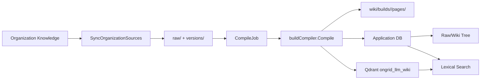

# RFC-004：LLM Wiki 编译、存储与检索实现

## 元信息

- 状态：已完成
- 日期：2026-09-11
- 关联 ADR：[ADR-033：LLM Wiki 架构](../adr/ADR-033-llm-wiki-architecture.md)
- 关联 HLD：[HLD-002：LLM Wiki 可审计知识编译层](../design/HLD-002-llm-wiki.md)

## 背景

LLM Wiki 需要从组织知识库生成可重建的页面，并同时满足：

- Source 和版本可审计。
- LLM 输出不能直接决定数据库 ID、页面路径和 build 状态。
- 单次编译可以只处理选定 Source，同时保留其他现有页面。
- 页面 artifact、catalog 和派生索引在失败时保持可恢复边界。
- MySQL/SQLite 共享词法检索语义。
- 配置 embedder 时使用 Qdrant 做页级向量检索。

## 当前架构

## 一、来源同步

`POST /v1/knowledge/llm-wiki/sync` 当前读取组织知识库的 `manual` 和 `upload` 文档。

每个文档：

- `SourceKey = organization:<doc.ID>`
- Raw 路径：`doc.Path/<doc.Title>.md`
- 内容写入 Raw 文件
- 内容写入 `.llm-wiki/versions/<source-hash>/<sha256>.md`
- Source/Version 写入应用数据库

同步结束时，已不存在于组织知识库的 `organization` Source 会被删除。

## 二、版本和身份

- Source：`(tenant_id, source_key)` 唯一。
- SourceVersion：`(tenant_id, source_id, sha256)` 唯一。
- 新 Source 状态：`pending`。
- 内容变化且已有版本：`stale`。
- 内容相同：复用版本；路径变化只更新 Source 元数据。
- 当前编译成功路径不写 `succeeded`。
- `Reconcile` 无法恢复 Raw 时写 `failed`。

## 三、编译管线

### 1. staging build

`Compile` 首先创建 `WikiBuild{status: staging}`。

### 2. Corpus

- 全部 Source 或 `source_ids` 子集。
- 跳过无当前版本、小于 100 bytes、内容 hash 重复的文档。
- 当前实际最多加载 200 个 Source。

### 3. Chunk

- 按 `\n\n` 分段。
- 目标约 4000 token，使用 `4 bytes/token` 近似。
- 超长单段不再细分。

### 4. digest

- 小于 32000 token：直接使用 chunk 文本。
- 大于等于 32000 token：逐 chunk 调用 LLM 生成纯文本摘要。
- 当前没有 cache、batch、层级摘要或 repair。

### 5. Planner

- 首选严格 JSON Schema。
- 第一次请求失败时回退 `json_object`。
- 本地校验 pages/page_id/title/sections。
- `page_id` Prompt 要求 kebab-case，但代码没有格式校验。

### 6. Evidence

- section `source_ids` 是 digest 下标。
- 非法下标失败。
- 无法映射到 Corpus 的来源被忽略。
- BuildPage 的 `source_refs_json` 记录 Source、Version、首 chunk ordinal、内容 hash 和来源路径。

### 7. Writer

- 已带 Markdown 结构或超过 3 行的 section 原样保留。
- 其他 section 调用 LLM 优化。
- LLM 失败时回退原始文本。
- 页面末尾追加 `## Sources`。

### 8. 增量继承

当只编译选定 Source 时：

- 引用所选 Source 的旧页面由新结果替换。
- 不引用所选 Source 的旧页面复制到新 build。
- 复制前校验旧 artifact hash。

### 9. 校验、索引和发布

- 页面文件必须存在且 SHA-256 匹配。
- 索引失败为 warning，不阻止发布。
- Build 状态改为 `validated`。
- `ActivateBuild` 在事务中把旧 active 标记为 `superseded`，把新 build 标记为 `active`。
- 旧 build artifact 在新 build 激活后删除；数据库行保留。

## 四、存储

### FileStore

- `raw/`
- `.llm-wiki/versions/`
- `wiki/builds/`

`Ensure` 删除 concepts/entities、topics/sources、index/log、staging、schema 等非当前布局路径。

### 应用数据库

MySQL/SQLite 双方言：

- `wiki_sources`
- `wiki_source_versions`
- `wiki_source_chunks`
- `wiki_compile_jobs`
- `wiki_builds`
- `wiki_build_pages`
- `wiki_lexical`
- `wiki_index_meta`

`wiki_source_chunks` 当前没有生产写入路径。

### Qdrant

- collection：`ongrid_llm_wiki`
- point ID：tenant + page ID 的 SHA-256 前 8 字节
- payload 只保存 tenant、page ID、page type、title、body hash

## 五、检索

词法检索：

- `wiki_lexical`
- `LIKE ... ESCAPE '!'`
- title、aliases、content 匹配
- aliases 当前没有写入数据

向量检索：

- `title + "\n\n" + content` embedding
- tenant filter
- `body_hash` 未变化时跳过 embedding
- 向量错误直接返回

融合：

- Wiki 内部词法/向量使用 RRF 常数 60
- HybridSearcher 使用 Wiki 权重 1.5、Raw 权重 1.0

## 六、任务

- 状态：`pending/running/succeeded/skipped/failed/cancelled`
- 页面数为 0：`skipped`
- 其他成功：`succeeded/completed`
- 失败：stage 为失败步骤
- 取消：立即写 `cancelled`，worker 在阶段边界检查
- `force` 当前只持久化，不参与执行逻辑
- 当前没有生产 worker 循环，创建/重试时直接在 goroutine 中执行
- 进程重启不会自动拉起 pending job
- 过期 running job 可由 ClaimJob 恢复

## 七、失败与恢复

- 编译失败：Build 标为 `failed`，清理 staging artifact 和 BuildPage/Build 行。
- 发布前取消：执行相同清理。
- 索引失败：不回滚已发布页面，不改变 job stage。
- `Reconcile`：只恢复缺失 Raw 文件，不处理 build manifest。
- 没有 `index_failed` stage。

## 八、前端和 API

保留的 API 为：

- `GET tree`
- `GET nodes/{id}`
- `GET nodes/{id}/preview`
- `DELETE nodes/{id}`
- `GET sources`
- `GET search`
- `GET jobs`
- `POST sync`
- `POST compile`
- `POST jobs/{id}/retry`
- `POST jobs/{id}/cancel`

前端支持 Raw/Wiki 树、详情、PDF/DOCX 预览、单 Source 编译、删除、任务取消/重试和来源跳转。

## 备选方案

### 五层公共 IR 和 Topic/Evidence pipeline

可以提供更细的阶段类型，但当前代码没有这些模型和表。

### 单 SQLite 和 staging manifest

提供单目录存储，但当前实现选择共享应用数据库，且没有 manifest reconcile。

### 数据库 BLOB 向量

无需 Qdrant，但会产生进程内线性扫描。

### 只保留词法检索

实现简单，但无法提供语义召回。

## 影响范围

- Biz：`internal/manager/biz/knowledge/llm_wiki/`
- Data：`internal/manager/data/knowledge/llm_wiki/`
- Server：`internal/manager/server/knowledge/llmwiki_http.go`
- Service：`internal/manager/service/knowledge/`
- Frontend：`web/src/features/llm-wiki/`
- Migration：`db/migrations/20260918100000_add_llm_wiki_tables`
- Files：`ONGRID_LLM_WIKI_DIR`

## 验收标准

- Source 同步和版本复用可验证。
- 编译可按全部或选定 Source 执行。
- 页面 artifact hash 与数据库一致后才能发布。
- active build 切换使用数据库事务。
- 未受影响的旧页面在增量编译中保留。
- 词法索引隔离 tenant，LIKE 通配符按字面匹配。
- Qdrant point ID 稳定且 tenant-scoped。
- 配置 embedder 时 Qdrant 不可用会使 Wiki 初始化失败。
- Go 相关包 `-race` 测试和前端 typecheck/test 通过。

## 实施状态

- [x] 组织知识库同步。
- [x] Source/Version 镜像。
- [x] Corpus 加载与切块。
- [x] 短 Corpus 直通与长 Corpus 摘要。
- [x] Planner JSON Schema/json_object。
- [x] Evidence resolver。
- [x] Writer 和来源 footer。
- [x] Build artifact 和 hash 校验。
- [x] 增量继承。
- [x] active build 事务切换。
- [x] `wiki_lexical` 和 Qdrant 索引。
- [x] HTTP API 和前端树。
- [x] 编译阶段逐次调用 `TokenUsageSink.Record`，并复用 AIOps token 总量。

## 当前未实现

- chunk cache、batch 和层级摘要。
- Topic/Evidence/Canonical 页面。
- staging manifest。
- 自动 worker 消费 pending job。
- `force_compile` 执行逻辑。
- Source `succeeded` 状态更新。
- LLM Wiki 专用 metrics 更新。
- fake LLM 完整编译测试和真实 Qdrant E2E。
- OpenAI-compatible embedding token 用量。
- Wiki 编译调用接入每日 token budget。
